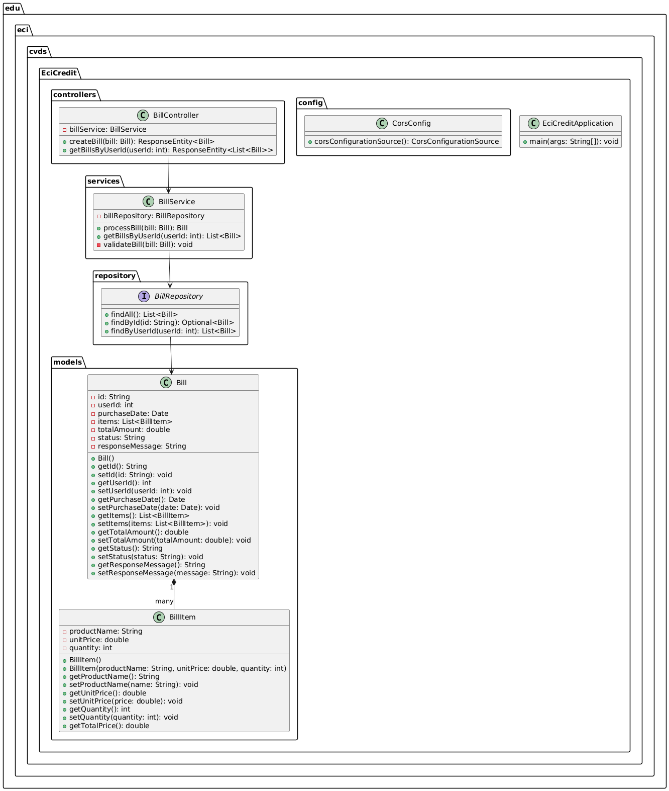
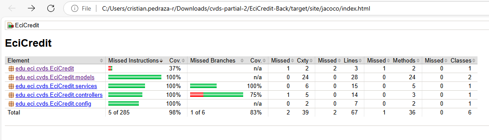
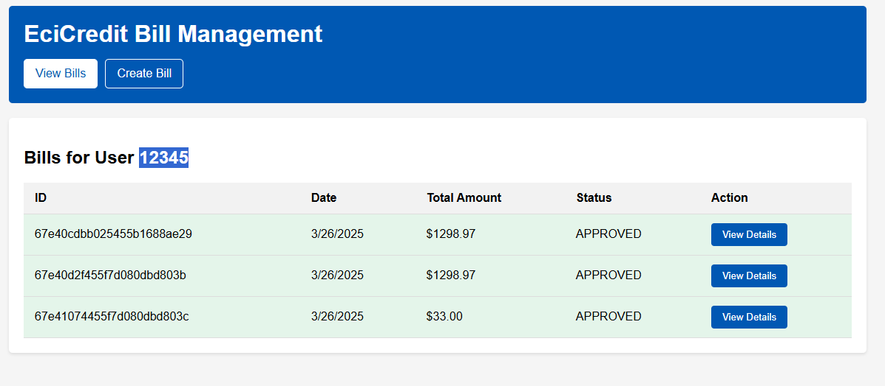
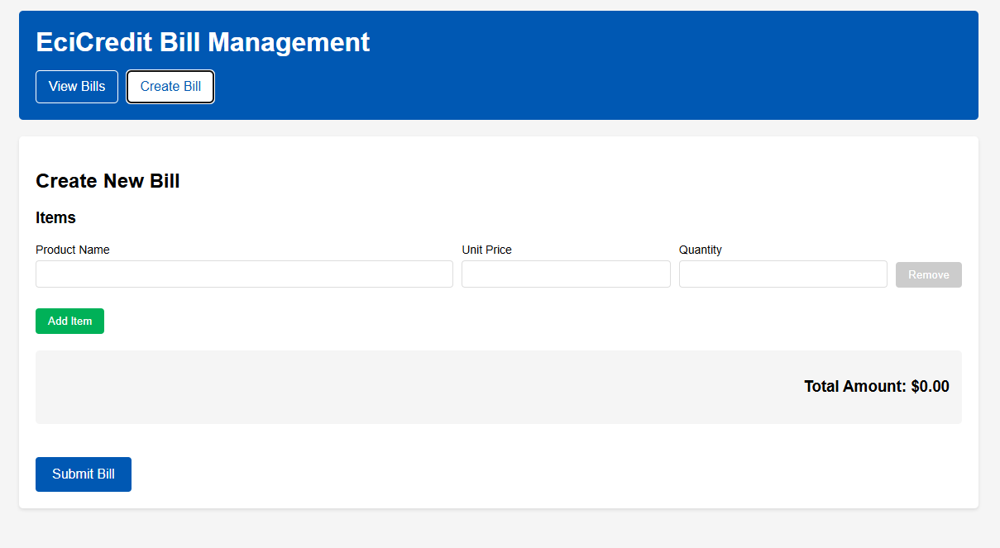
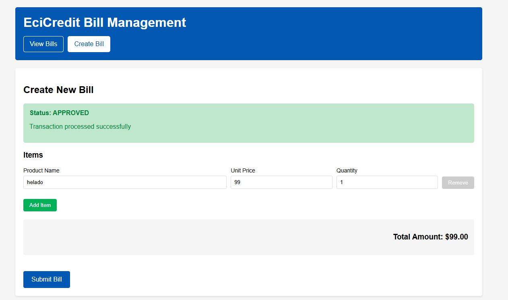
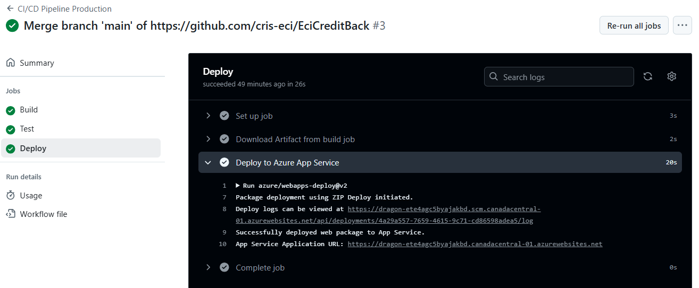
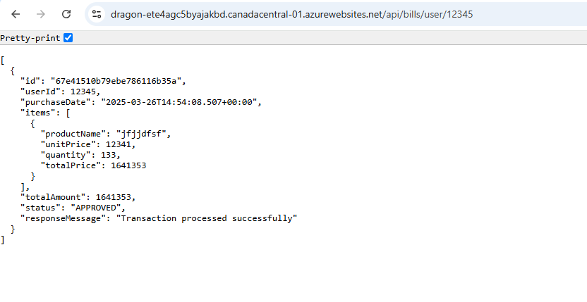

## EciCredit - Sistema Bancario

Este repositorio contiene el backend del proyecto EciCredit, un sistema bancario para la gestión de facturas y pagos.

### Arquitectura

#### Arquitectura Backend
El backend está implementado como una aplicación Spring Boot con MongoDB como base de datos, siguiendo una arquitectura por capas:

- **Capa de Controladores**: Maneja las peticiones HTTP y delega a los servicios
- **Capa de Servicios**: Implementa la lógica de negocio
- **Capa de Repositorios**: Interactúa con la base de datos MongoDB
- **Capa de Modelos**: Define las entidades del dominio

### Tecnologías Implementadas

#### Backend
- Java 17
- Spring Boot 3.1.x
- MongoDB
- JaCoCo para cobertura de código
- Maven para gestión de dependencias
- GitHub actions

### Cómo Ejecutar el Proyecto

#### Backend
1. Clonar este repositorio
2. Asegurar tener instalados Java 17 y Maven
3. Navegar al directorio raíz
4. Ejecutar `mvn spring-boot:run`
5. La API estará disponible en http://localhost:8080

### Endpoints de API Implementados

El backend actualmente proporciona los siguientes endpoints:

- `GET /api/bills/user/{userId}` - Obtiene todas las facturas de un usuario específico
- `POST /api/bills` - Crea una nueva factura

### Cobertura de Código

El proyecto mantiene una cobertura de pruebas utilizando JaCoCo:

### Funcionalidades Implementadas

#### Consulta de Facturas de Usuario
El sistema permite consultar las facturas asociadas a un ID de usuario. Actualmente, hay facturas disponibles para el usuario con ID 12345.

#### Detalles de Factura
El sistema proporciona información detallada de las facturas incluyendo estado, fecha de creación, monto total y elementos individuales.

#### Creación de Facturas
La API permite crear nuevas facturas con la información requerida.

#### Gestión de Elementos de Factura
Se pueden añadir múltiples elementos a una factura.

#### Procesamiento de Transacciones
El sistema procesa las transacciones y devuelve el estado resultante.

### Despliegue

El backend está desplegado en Azure y accesible en:
https://dragon-ete4agc5byajakbd.canadacentral-01.azurewebsites.net/

### Frontend Repository

El código fuente del frontend de EciCredit está disponible en un repositorio separado:
[EciCreditFront](https://github.com/cris-eci/EciCreditFront)

Para obtener información sobre la implementación y ejecución del frontend, por favor consulte el repositorio correspondiente.

### GitHub Actions y despliegue en azure

